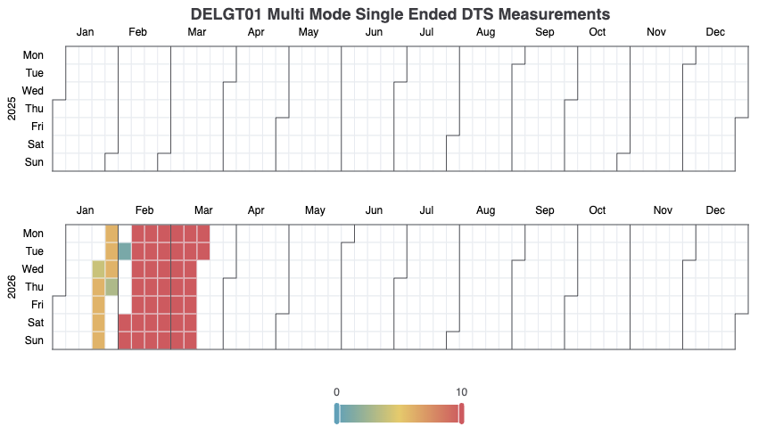
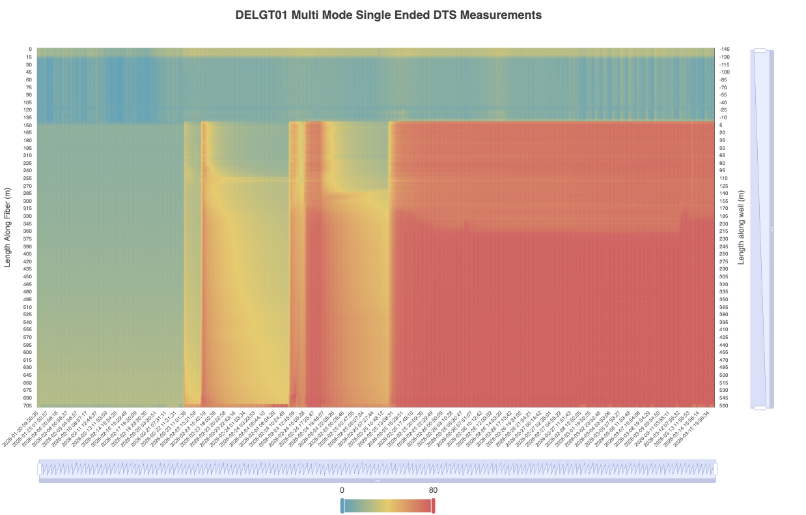

# visDTS

visDTS is a collection of functions for generating charts from DTS measurements, which are saved as Parquet files.

## Installation

Setting up a virtual environment with conda is recommended for this repository's dependencies.

```bash
# clone the repository to your local
git clone https://github.com/shnmrt/visDTS
# Navigate to the cloned folder
cd visDTS
# create the virtual environment with provided file
conda env create -f environment.yml
# to activate the virtual environment
conda activate visDTS
```

You can execute the code that is provided in the notebook in VSCode or Jupyter Notebook using the created virtual environment.

## Examples

You can see the example plots below.

#### Calendar chart



#### Heatmap chart


